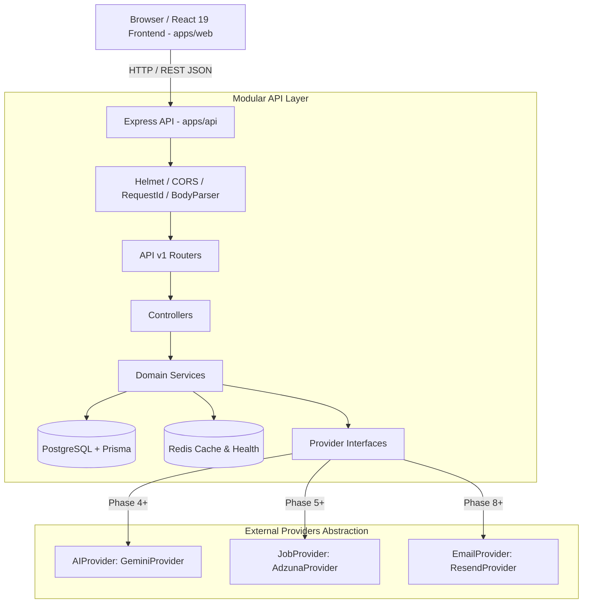
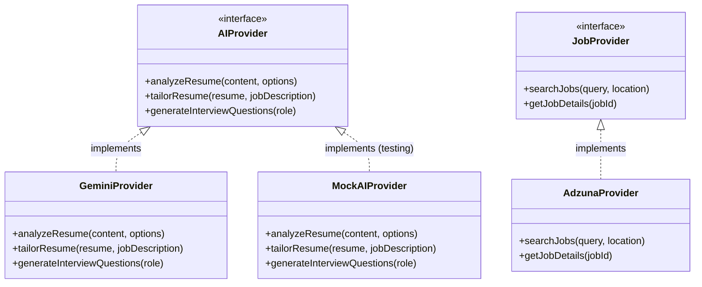
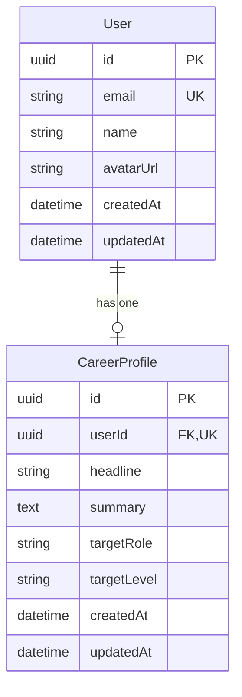
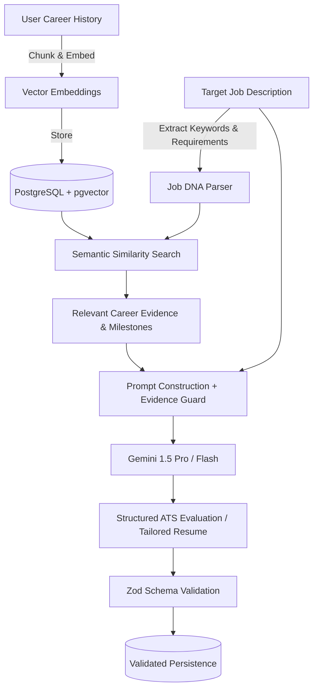

# Resumind — System Architecture Document

## 1. System Overview

**Resumind** is designed as a modular, production-grade full-stack platform for career and resume optimization. The system is architected as a modular monolith with clean domain boundaries, provider abstractions for external dependencies, and strict type safety across the stack.

---

## 2. High-Level System Architecture



---

## 3. Layered Design Pattern

The API architecture enforces a one-way dependency flow:

```
Request
   ↓
Middleware (Security, Request ID, Logging)
   ↓
Router (/api/v1/...)
   ↓
Controller (HTTP status codes, parameter extraction, response serialization)
   ↓
Service (Core business logic, domain rules, orchestration)
   ↓
Repository / Prisma Client (Data access, queries, transactions)
   ↓
Database (PostgreSQL) / Cache (Redis)
```

### Layer Responsibilities

- **Controllers:** Receive requests, trigger input validation, call domain services, and return standard JSON response envelopes (`{ success, data, error }`). Controllers contain **no business logic**.
- **Services:** Pure TypeScript domain services encapsulating business rules, validations, and orchestration. Services are decoupled from Express `req` and `res` objects.
- **Provider Abstractions:** External APIs (AI models, job feeds) implement standard TypeScript interfaces. The application core depends on the interface, never on third-party SDKs directly.

---

## 4. Provider Abstraction Pattern

To prevent vendor lock-in and enable straightforward mock testing, external integrations follow the provider pattern:



---

## 5. Database Architecture (PostgreSQL + Prisma)

### 5.1 Phase 1 Implemented Models

In Phase 1, only the baseline user and profile foundation are defined:



### 5.2 Future Planned Domain Models (Phase 2+)

Future phases will introduce relational entities:

- **Career History:** `Experience`, `Education`, `Project`, `Skill`, `Achievement`, `Certification`, `Evidence`.
- **Resume Entities:** `Resume`, `ResumeVersion`, `ResumeAnalysis`.
- **Market & Matching:** `Job`, `JobRequirement`, `JobMatch`.
- **Application Tracking:** `Application`, `ApplicationEvent`.
- **Interview Suite:** `Interview`, `InterviewQuestion`, `InterviewAnswer`.
- **Auditing & Usage:** `AIUsage`.

---

## 6. Redis Architecture

- **Phase 1 Role:** Connection verification, health check probe, and containerized Docker setup.
- **Future Roles (Phase 2+):**
  - Session and refresh token blacklist.
  - Rate limiting key storage (`express-rate-limit` Redis store).
  - High-frequency cache for job search queries.
  - Task queue broker for background document processing.

---

## 7. Future AI & RAG Architecture (Planned for Phase 4+)

When AI-powered tailoring and ATS evaluation are introduced in later phases, the Retrieval-Augmented Generation (RAG) pipeline will operate as follows:



---

## 8. Directory & Monorepo Structure

```
resumind/
├── apps/
│   ├── web/                     # React 19 Frontend application
│   │   ├── app/                 # Routes, components, services, stores
│   │   ├── public/              # Static assets, pdf.worker.js
│   │   └── tests/               # Frontend Vitest smoke tests
│   └── api/                     # Express.js Backend application
│       ├── src/                 # Controllers, services, middleware, routers
│       ├── prisma/              # schema.prisma, migrations, seed.ts
│       └── tests/               # Supertest integration tests
├── packages/
│   ├── shared-types/            # Common TypeScript interfaces & envelopes
│   ├── validation/              # Common Zod validation schemas
│   ├── config/                  # Constants & HTTP status mappings
│   ├── utils/                   # Pure utility helpers
│   └── ui/                      # Shared UI primitives
├── docs/                        # Architectural documentation, PRD, rules
├── docker-compose.yml           # PostgreSQL 16 + Redis 7 services
├── package.json                 # Monorepo root workspace configuration
└── tsconfig.base.json           # Base compiler options
```
