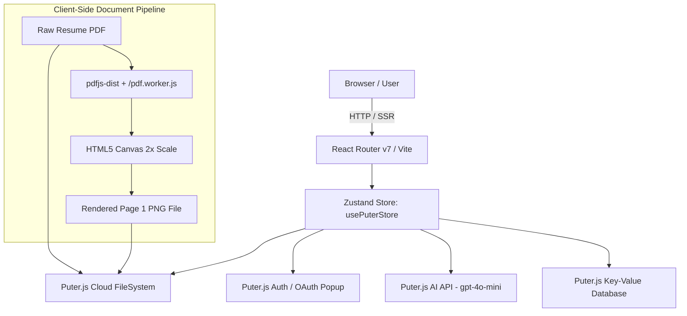

# Resumind — Phase 1 Baseline Audit

## 1. Executive Summary

- **Project Name:** AI Resume Analyzer (rebranding to **Resumind**)
- **Baseline Date:** September 28, 2026
- **Auditor:** Antigravity AI Pair Programmer
- **Current State:** Functional prototype leveraging React Router v7 with SSR capabilities and client-side Puter.js integration for authentication, file storage, AI evaluation, and key-value persistence.
- **Phase 1 Objective:** Establish an enterprise-ready, modular full-stack engineering foundation (React/Vite/Bootstrap frontend, Express/TypeScript backend, PostgreSQL with Prisma ORM, Redis, Docker, and comprehensive documentation) without breaking existing functionality.

---

## 2. Baseline Architecture



---

## 3. Current Technology Stack & Dependencies

### Frontend Stack

- **Framework:** React 19 (`react` 19.2.4, `react-dom` 19.2.4)
- **Routing & SSR:** React Router 7 (`react-router` 7.13.2, `@react-router/node`, `@react-router/serve`, `@react-router/dev`)
- **Build Tool:** Vite 7 (`vite` 7.1.7, `@tailwindcss/vite`, `vite-tsconfig-paths`)
- **Styling:** Tailwind CSS v4 (`tailwindcss` 4.2.2, `@tailwindcss/vite`, `tw-animate-css`) with custom CSS utilities in `app/app.css`
- **State Management:** Zustand 5 (`zustand` 5.0.12)
- **Charts & Visualization:** Recharts (`recharts` 3.8.1)
- **Document Processing:** PDF.js (`pdfjs-dist` 3.11.174) with dedicated `/public/pdf.worker.js`
- **Animation & Icons:** Framer Motion (`framer-motion` 12.38.0), Lucide React (`lucide-react` 1.6.0)
- **Form / File Ingestion:** React Dropzone (`react-dropzone` 15.0.0)

### Backend / Serverless Stack

- **Puter.js SDK (v2):** Injected via `<script src="https://js.puter.com/v2/"></script>` in `app/root.tsx`.
- Provides serverless Authentication, Virtual Filesystem (FS), Key-Value (KV) database, and AI evaluation services (`gpt-4o-mini`).

---

## 4. Current Routes & Access Matrix

| Route         | Handler Component       | Protection                              | Description                                                                                                                                        |
| :------------ | :---------------------- | :-------------------------------------- | :------------------------------------------------------------------------------------------------------------------------------------------------- |
| `/`           | `app/routes/home.tsx`   | Client Auth Guard                       | Main dashboard with search, company filter, Recharts score trends line chart, and grid of resume cards.                                            |
| `/auth`       | `app/routes/auth.tsx`   | Public                                  | Puter.js SSO login / logout screen. Supports redirect back via `?next=` query parameter.                                                           |
| `/upload`     | `app/routes/upload.tsx` | Unprotected (client redirects on error) | Form to upload PDF resume, enter target company, job title, and job description, then invokes PDF-to-image rasterization and AI feedback.          |
| `/resume/:id` | `app/routes/resume.tsx` | Client Auth Guard                       | Split-screen review page: left pane displays rendered PDF preview, right pane displays detailed ATS score, summary gauge, and category accordions. |
| `/edit/:id`   | `app/routes/edit.tsx`   | Client Auth Guard                       | Score trend preview component displaying Recharts LineChart.                                                                                       |
| `/wipe`       | `app/routes/wipe.tsx`   | Client Auth Guard                       | Administrative debugging utility to inspect Puter FS directory items, delete individual files, and flush KV database.                              |

---

## 5. Current Data Flow & Storage

### 5.1 Puter KV Storage

- **Key Pattern:** `resume:${UUID}`
- **Value:** Serialized JSON payload containing:
  ```typescript
  {
    id: string; // UUID v4
    companyName: string; // e.g. "Google"
    jobTitle: string; // e.g. "Frontend Developer"
    jobDescription: string; // Plain text job description
    resumePath: string; // Puter FS path to the PDF (e.g., 'resume.pdf')
    imagePath: string; // Puter FS path to page 1 PNG (e.g., 'resume.png')
    feedback: Feedback; // AI Feedback JSON object
  }
  ```

### 5.2 Feedback Data Schema

```typescript
interface Feedback {
  overallScore: number;
  ATS: { score: number; tips: { type: 'good' | 'improve'; tip: string }[] };
  toneAndStyle: CategoryFeedback;
  content: CategoryFeedback;
  structure: CategoryFeedback;
  skills: CategoryFeedback;
}

interface CategoryFeedback {
  score: number;
  tips: { type: 'good' | 'improve'; tip: string; explanation: string }[];
}
```

### 5.3 Puter Virtual Filesystem (FS)

- Stores original uploaded resume PDFs (`uploadedFile.path`).
- Stores converted 2x PNG thumbnail previews (`uploadedImage.path`).
- Fetched client-side via `URL.createObjectURL(blob)` from `fs.read(path)`.

---

## 6. Current AI Integration

- Model: `gpt-4o-mini` accessed via Puter.js `puter.ai.chat()` and `puter.ai.feedback()`.
- Multimodal File Attachment: Pass `{ type: 'file', puter_path: path }` directly to Puter AI.
- Prompting Strategy: Formatted in `app/constants/index.ts` via `prepareInstructions({ jobTitle, jobDescription })`, requesting strict JSON matching the `AIResponseFormat` interface with markdown backticks omitted.

---

## 7. Current Reusable Components

| Component      | File                              | Responsibility                                                                       |
| :------------- | :-------------------------------- | :----------------------------------------------------------------------------------- |
| `Accordion`    | `app/components/Accordion.tsx`    | Context-driven accordion with smooth collapse animation.                             |
| `ATS`          | `app/components/ATS.tsx`          | Visual ATS score card with dynamic gradients and tip icons.                          |
| `Details`      | `app/components/Details.tsx`      | Category-specific feedback rendering inside Accordions.                              |
| `FileUploader` | `app/components/FileUploader.tsx` | Drag-and-drop zone using `react-dropzone` with size limit (20MB) and PDF validation. |
| `Navbar`       | `app/components/Navbar.tsx`       | Global header with logo and "Upload Resume" button.                                  |
| `ResumeCard`   | `app/components/ResumeCard.tsx`   | Resume card with download, delete, and edit triggers.                                |
| `ScoreBadge`   | `app/components/ScoreBadge.tsx`   | Color-coded status chip (green/yellow/red).                                          |
| `ScoreChart`   | `app/components/ScoreChart.tsx`   | Line chart mapping company name to overall ATS score.                                |
| `ScoreCircle`  | `app/components/ScoreCircle.tsx`  | Circular score indicator.                                                            |
| `ScoreGauge`   | `app/components/ScoreGauge.tsx`   | SVG semi-circular gauge with stroke-dashoffset gradient animation.                   |
| `Summary`      | `app/components/Summary.tsx`      | Top-level summary card with overall gauge and subcategory breakdown.                 |

---

## 8. Technical Debt, Code Duplication & Potential Bugs

1. **Client-Side Auth Guards:**
   - Routes check `auth.isAuthenticated` in client-side `useEffect` hooks rather than using server-side / route loaders. This causes a brief visual flash of content before redirecting to `/auth`.
2. **Missing Backend & Database:**
   - Entire data persistence relies on third-party client-side Puter.js KV and FS. There is no dedicated API server, no relational schema, no ACID transactions, and no server-side validation.
3. **No Automated Testing:**
   - Zero test files exist in the repository (no Vitest, Jest, Supertest, or Playwright configuration).
4. **Error Handling & Resiliency:**
   - AI response parsing uses raw `JSON.parse(feedbackText)` in `app/routes/upload.tsx`. If the LLM produces invalid JSON or hallucinated markdown wrappers, the entire upload flow throws an uncaught error.
5. **Tailwind CSS v4 & Styling Fragmentation:**
   - Uses Tailwind CSS v4 in `app/app.css` while the target project specification mandates standard Bootstrap 5 without Tailwind for the unified design system.
6. **Hardcoded WebStorm Playground Artifacts:**
   - `index.html` and `src/main.js` were leftover starter templates containing JetBrains WebStorm default counter demo code.
7. **Accessibility (a11y) & SEO Deficiencies:**
   - Input elements lack explicit `id` and `htmlFor` pairings on `<label>`.
   - Missing OpenGraph, Twitter Card metadata, canonical URLs, and structured data schemas.
   - Contrast ratios on custom gradient badges need formal WCAG AA verification.

---

## 9. Baseline Verification Results

| Verification Step    | Command             | Result    | Notes                                                              |
| :------------------- | :------------------ | :-------- | :----------------------------------------------------------------- |
| **Dependencies**     | `npm install`       | ✅ Passed | 272 packages installed cleanly, audited.                           |
| **TypeScript**       | `npm run typecheck` | ✅ Passed | `react-router typegen && tsc` passed with 0 errors.                |
| **Production Build** | `npm run build`     | ✅ Passed | Vite client and React Router server SSR bundles compiled in 31.3s. |
| **Dev Server**       | `npm run dev`       | ✅ Passed | Vite development server started on `http://localhost:5173/`.       |
| **Route `/`**        | HTTP GET            | ✅ 200 OK | Full SSR HTML document rendered.                                   |
| **Route `/auth`**    | HTTP GET            | ✅ 200 OK | Auth component rendered.                                           |
| **Route `/upload`**  | HTTP GET            | ✅ 200 OK | Form & dropzone rendered.                                          |
| **Route `/wipe`**    | HTTP GET            | ✅ 200 OK | Storage administration UI rendered.                                |

---

## 10. File Preservation & Migration Plan

### Files to Preserve Intact

- `app/routes/*` (existing routes must continue to function).
- `app/components/*` (all 11 UI components to be retained for backward compatibility).
- `app/lib/*` (`pdf2img.ts`, `puter.ts`, `utils.ts` preserved so existing flows remain functional).
- `app/constants/index.ts`, `app/types/*`.
- `public/*` (icons, images, `pdf.worker.js`).

### Target Modular Monorepo Layout

```
resumind/
├── apps/
│   ├── web/               # Frontend (React 19, React Router v7, Bootstrap 5, TanStack Query, Vitest)
│   └── api/               # Backend (Express, TypeScript, Zod, Prisma, PostgreSQL, Redis, Pino)
├── packages/
│   ├── shared-types/      # Common API response interfaces, pagination, shared DTOs
│   ├── validation/        # Common Zod validation schemas
│   ├── config/            # Shared configuration constants
│   ├── utils/             # Pure shared utility functions
│   └── ui/                # Shared UI primitives
├── docs/                  # PRD, Architecture, Rules, Phases, Walkthroughs, Audits
├── docker-compose.yml     # PostgreSQL + Redis local development containers
├── package.json           # Root workspace configuration
└── tsconfig.base.json     # Base TypeScript configuration
```

### Migration Risks & Mitigation

- **Risk:** Breaking existing React Router v7 paths when moving to `apps/web`.
  - **Mitigation:** Retain the exact Vite and React Router configs, ensure tsconfig paths match `~/*`, and perform step-by-step typecheck and build validation.
- **Risk:** Conflicting CSS when introducing Bootstrap 5 alongside existing styles.
  - **Mitigation:** Scope Bootstrap cleanly without global namespace collision, leaving existing components visually intact for Phase 1.
